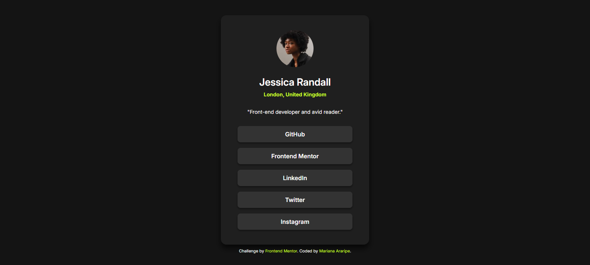

# Frontend Mentor - Perfil de Links Sociais

Este é um projeto baseado no desafio [Social Links Profile](https://www.frontendmentor.io/challenges/social-links-profile-UG32l9m6dQ) do Frontend Mentor. O objetivo é criar um cartão de perfil com links para redes sociais, utilizando HTML e CSS de forma responsiva e acessível.

---

## 🛠️ Tecnologias Utilizadas

- HTML5 semântico
- CSS3 com variáveis (`custom properties`)
- Flexbox
- Design responsivo (mobile-first)
- Acessibilidade com `aria-label`

---

## 🎯 Objetivo

Praticar a construção de componentes visuais a partir de um design estático, focando na organização de layout com Flexbox, estilização moderna com variáveis CSS e atenção a estados de interação (`hover`/`focus`). Também busquei aplicar boas práticas de acessibilidade.

---

## 📸 Screenshot / Captura de Tela

---

## 🔗 Links

- [🔗 Visualizar Projeto](https://marianaararipe.github.io/perfil-links-sociais/)
- [📂 Código no GitHub](https://github.com/marianaararipe/perfil-links-sociais)
- [📂 Repositório no Frontend Mentor](https://www.frontendmentor.io/solutions/perfil-links-social-media-htmlcss-IjunAQ1jLM)

---

## 💡 O que aprendi

Durante o desenvolvimento desse projeto, aprendi e reforcei conhecimentos como:

- Como aplicar `aria-label` para melhorar acessibilidade
- A importância de estados visuais (`hover`, `focus`) para elementos interativos
- Como utilizar variáveis CSS para facilitar manutenção de cores e estilos

---

## 📚 Recursos úteis

- [Guia do Flexbox - CSS Tricks](https://css-tricks.com/snippets/css/a-guide-to-flexbox/)
- [MDN Web Docs - Acessibilidade com ARIA](https://developer.mozilla.org/pt-BR/docs/Web/Accessibility/ARIA)
- [Frontend Mentor](https://www.frontendmentor.io/)

---
## 👤 Autor

- GitHub: [@marianaararipe](https://github.com/marianaararipe)
- Frontend Mentor: [@marianaararipe](https://www.frontendmentor.io/profile/marianaararipe)
